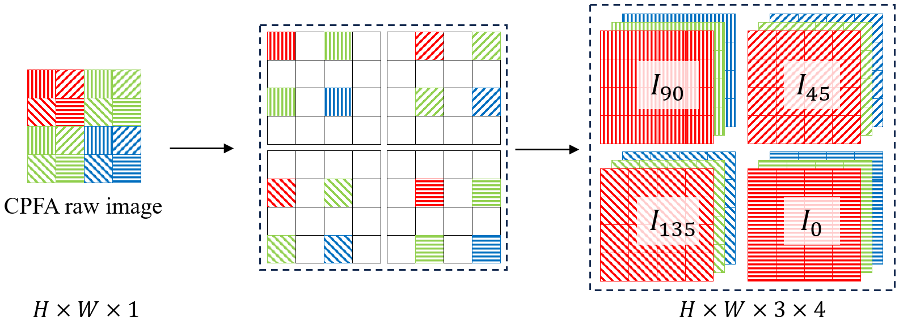

# 基本概念

## 偏振

根据光矢量在垂直于传播方向平面内的振动方式，可以将光分为以下几类：

1. 自然光（Unpolarized Light）

其光波矢量的振动在垂直于光的传播方向上作无规则取向，但统计平均来说，在空间所有可能的方向上，光波矢量的分布可看作是机会均等的，它们的总和与光的传播方向是对称的，即光矢量具有轴对称性、均匀分布、各方向振动的振幅相同，这种光就称为自然光。

2. 完全偏振光（Fully Polarized Light）
  - 线偏振光（Linearly Polarized Light）：光矢量只沿着一个确定的方向振动，其大小随相位变化、方向不变，称为线偏振光
  - 圆偏振光（Circularly Polarized Light）：光矢量不断旋转，其大小、方向随时间有规律的变化。
  - 椭圆偏振光（Elliptically Polarized Light）：光矢量不断旋转，其大小不变，但方向随时间有规律地变化

3. 部分偏振光（Partially Polarized Light）

可看作自然光与完全偏振光的叠加体。

## Stokes 矢量
在光学领域，通常使用两种常见的方法来描述光的偏振状态。

1. Mueller-Stokes 微分方程：使用 Stokes 向量表示光的偏振状态，偏振状态包含完全偏振、部分偏振、无偏振。所以光在传播过程中与其他光学元件的相互作用便可定义为原有的 Stokes 向量与 Mueller 矩阵相乘得到新的 Stokes 向量。Stokes 矢量可用于描述完全偏振光、部分偏振光与非偏振光。
2. Jones 微分矩阵：使用 Jones 向量和矩阵，直接与波的电场分量相关联。

由于 Jones 微分方程只能表示完全偏振的光，在实际应用中会非常局限，所以绝大部分文献均会以 Mueller-Stokes 微分方程为基础进行展开介绍。

Stokes 矢量定义如下

$$\mathbf{S}=[S_0,S_1,S_2,S_3]$$

其中，

$$S_0$$：描述光的强度（intensity），不含任何偏振信息。（在物理渲染时用来表示辐射强度）

$$S_1$$：描述水平和垂直的线性偏振。$$S_1=1$$ 时表示水平偏振（horizontally linear polarization）或 0° 线性偏振，$$S_1=-1$$ 时表示垂直偏振（vertically linear polarization）或 90° 线性偏振。

$$S_2$$：描述 45° 的对角线性偏振（diagonal linear polarization）。$$S_2=1$$ 时表示 +45° 的线性偏振，$$S_2=-1$$ 时表示 -45° 的线性偏振（或 135° 线性偏振）。

$$S_3$$：描述左旋和右旋的圆偏振。$$S_3=1$$ 时表示完全的右旋偏振光（left polarized circularly light），$$S_3=-1$$ 时表示完全的左旋偏振光（right polarized circularly light）。

上面几个参数要满足 $$S_0\geq\sqrt{S_1^2+S_2^2+S_3^2}$$

有些地方也会把 Stokes 矢量记为 $$\mathbf{S}=[I,Q,U,V]^T$$

由于圆偏振的情况在现实生活中很少见，所以大部分文献只研究线性偏振情况，忽略 $$S_3$$，即 $$\mathbf{S}=[S_0,S_1,S_2]^T$$

## 偏振度和偏振角

1. 线性偏振度（Degree of Linear Polarization, DoLP），是衡量光线线性偏振程度的指标，专门量化光的线性偏振成分，以此来忽略圆偏振的影响，线性偏振度的值可以从 0（完全非偏振光）到 1（完全偏振光）变化。

 $$DoLP=\frac{\sqrt{S_1^2+S_2^2}}{S_0}$$
 
2. 偏振角（Angle of Polarization, AoP），定义了线性偏振的方向相对于某个基准方向的偏转角度，范围是 $$[-\frac{\pi}{2},\frac{\pi}{2}]$$ 或 $$[0,\pi]$$。

$$AoP=\frac12\arctan 2(S_2,S_1)$$

注：$$\arctan 2(y,x)$$ 函数表示点 $$(x,y)$$ 到原点连线与 $$x$$ 轴之间的夹角大小

**偏振图像的采集和处理**

通常情况下为了捕获特定偏振角度下的图像，我们会在相机前面装上一块线性偏振片，过滤出某一指定角度的偏振光，并用相机记录其强度值。通过上述资料我们可以知道，Stokes 矢量需要通过 0°，45°，90°，135° 这 4 个方向的强度值来计算得到：

$$
\begin{aligned}
S_0 &= I_0 + I_{90} = I_{45} + I_{135} = \frac{I_0 + I_{45} + I_{90} + I_{135}}{2} \\
S_1 &= I_0 - I_{90} \\
S_2 &= I_{45} - I_{135}
\end{aligned}
$$

也就是想要获取全部偏振参数，需要拍摄 4 张图像（实际上至少只需要 3 张图像）

DoFP 偏振相机（Division of Focal Plane）：

为了解决传统方式下需要多次拍摄的问题（导致对动态场景不友好），现代偏振成像系统通常采用 DoFP 结构，即在每个像素上集成不同取向的微偏振片，从而实现单次曝光同时捕获多个偏振角度图像。

其中一种典型设计为 Color Polarization Filter Array（CPFA），它融合了偏振片与彩色滤波器阵列（类似于 Bayer CFA），通过对该偏振马赛克图进行去马赛克重建，可以恢复每个像素在不同偏振角度下的强度值，并进一步计算 Stokes 向量及偏振参数（DoLP、AoP）。

# 思考并完成以下练习

1. 偏振数据处理和公式应用

- 了解 RGB 相机和 snapshot 偏振相机的成像过程，说明什么是 RGB Bayer pattern 以及 Snapshot 偏振相机的 Bayer pattern，为什么 snapshot 偏振相机可以一次性拍摄 4 个不同偏振角度的图像？

- 用 Lucid 偏振相机拍出了一张 raw 格式的偏振图像，请编写代码从中提取出 0°，45°，90°，135° 的偏振图像（这张图片的像素是按照 Polarization Bayer Pattern 排布的）

- 处理好上一步的 4 张 RGB 图像后，请用代码计算 stokes 参数（S0，S1，S2）和偏振度（dop），偏振角（aop）并可视化（把计算公式写在下面再放图）

- 根据公式 $$I(\phi_{pol})=I_{un}+I_{un}\rho\cos(2(\phi_{pol}-\theta))$$ 说明为什么 aop 的求解会有 $$\pi$$-ambiguity，如果想要计算通过某种方式生成的一张 aop 与真实（gt）aop 之间的平均角度误差（Mean Angular Error），该如何计算

- 如果图像太暗了看不清，想要计算 stokes 和 aop 等，能否对图像先做 gamma 变换（或其他图像增强操作）再计算，为什么？

2. Mitsuba 渲染工具的使用

首先参考官方教程完成 mitsuba 安装：[Mitsuba3 官方安装教程](https://mitsuba.readthedocs.io/en/latest/index.html#installation)

然后参考下面的教程完成教程内的渲染任务： [Mitsuba新手教程](https://z1fow0wh5tr.feishu.cn/wiki/LElAw9aJgiVeGtkBxKwcNL3snxf)
